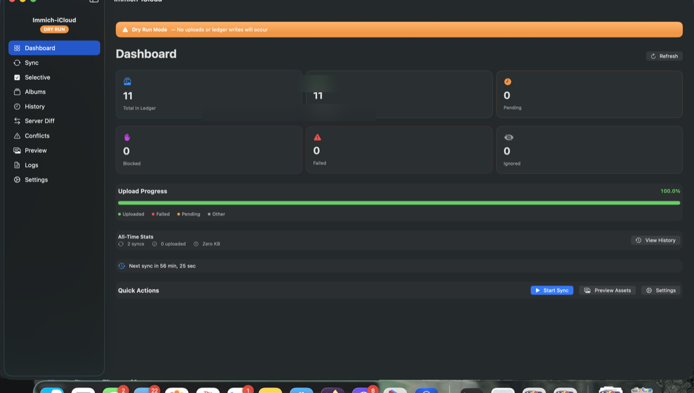
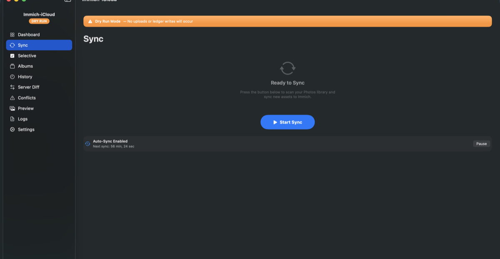
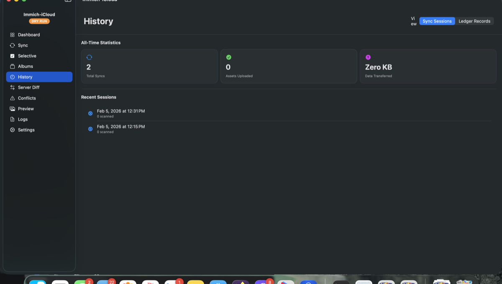
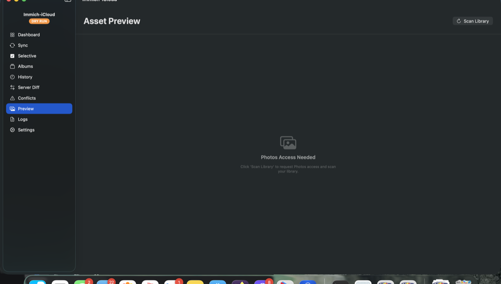
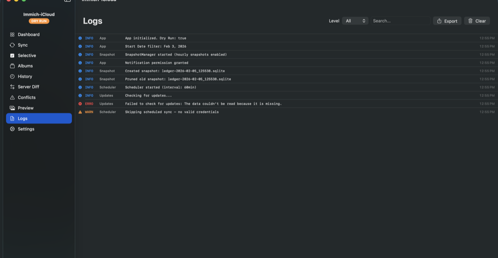
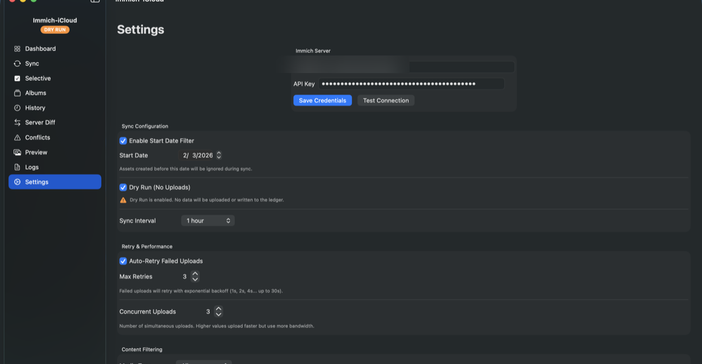

<p align="center">
  
</p>

<h1 align="center">Immich-iCloud</h1>

<p align="center">
  <strong>The ultimate bridge between iCloud Photos and your self-hosted Immich server.</strong><br>
  One-time uploads. Zero duplicates. Complete control.
</p>

<p align="center">
  <a href="https://github.com/bytePatrol/Immich-iCloud/releases"></a>
  
  
  
</p>

<p align="center">
  <a href="#-features">Features</a> •
  <a href="#-installation">Installation</a> •
  <a href="#-quick-start">Quick Start</a> •
  <a href="#-screenshots">Screenshots</a> •
  <a href="#%EF%B8%8F-building-from-source">Build</a>
</p>

---

## Why Immich-iCloud?

If you self-host [Immich](https://immich.app) but your primary photo library lives in iCloud Photos, you need a reliable bridge. **Immich-iCloud** is that bridge — a native macOS app that reads your Photos library via PhotoKit and uploads every photo and video to your Immich server.

### The One-Time Upload Guarantee

At its core, Immich-iCloud maintains a **local SQLite ledger** that tracks every upload by both asset ID and SHA-256 content fingerprint. Once an asset is recorded as uploaded, it will **never** be uploaded again — even if you:

- Delete it from Immich
- Reinstall the app
- Move to a new Mac (with ledger backup)
- Have duplicate files with different names

This isn't just a feature — it's the foundational promise of the entire application.

---

## Screenshots

<p align="center">
  
  <br><em>Dashboard — At-a-glance view of your sync status, server connection, and library statistics</em>
</p>

<details>
<summary><strong>View All Screenshots</strong></summary>

<br>

<p align="center">
  
  <br><em>Sync — Start, monitor, and control sync operations with real-time progress</em>
</p>

<p align="center">
  
  <br><em>History — View all-time statistics and detailed sync session history</em>
</p>

<p align="center">
  
  <br><em>Preview — Browse and explore your Photos library before syncing</em>
</p>

<p align="center">
  
  <br><em>Logs — Detailed event logging for troubleshooting and monitoring</em>
</p>

<p align="center">
  
  <br><em>Settings — Configure server, sync options, filters, and data management</em>
</p>

</details>

---

## Features

### Sync Engine

| Feature | Description |
|---------|-------------|
| **One-Time Upload** | Every asset uploads exactly once, tracked by local ID and SHA-256 fingerprint |
| **Dry Run Mode** | Simulate syncs without uploading — see exactly what would happen first |
| **Checkpoint & Resume** | Interrupted syncs save progress automatically; resume from where you left off |
| **Concurrent Uploads** | Upload 1-5 assets simultaneously for faster syncs |
| **Exponential Backoff** | Failed uploads retry with intelligent delays (1s → 2s → 4s... up to 30s) |

### Smart Filtering

| Feature | Description |
|---------|-------------|
| **Start Date Filter** | Only sync assets created after a specific date |
| **Media Type Filter** | Sync photos only, videos only, or both |
| **Favorites Only** | Restrict sync to your favorite assets |
| **Album Filtering** | Include specific albums, exclude albums, or sync from a single album |
| **Shared Albums** | Support for iCloud Shared Albums |

### Selective Sync

Choose exactly which assets to sync with the **Selective Sync** feature:

- Browse your library with thumbnail previews
- Select individual assets or entire groups
- Persist selections across app restarts
- Perfect for curated uploads

### Album Sync to Immich

Create and manage albums on your Immich server:

- Map local albums to Immich albums
- Auto-create albums on Immich when syncing
- Support for Smart Albums and Shared Albums
- Sync album membership along with assets

### Two-Way Reconciliation

Keep your ledger and Immich server in sync:

- **Orphaned Assets** — Find assets on Immich not in your ledger
- **Missing Assets** — Detect ledger entries deleted from Immich
- **Checksum Mismatches** — Identify content differences between local and server
- Batch delete orphaned assets directly from the app

### Conflict Resolution

Handle sync conflicts intelligently:

- Automatic conflict detection during reconciliation
- Review conflicts with detailed comparison views
- Multiple resolution strategies (keep local, keep server, skip)
- Track resolved vs. unresolved conflicts

### Automatic Sync

| Feature | Description |
|---------|-------------|
| **Scheduled Sync** | Auto-sync at configurable intervals (15 min to 24 hours) |
| **Wake Sync** | Automatically syncs when your Mac wakes from sleep |
| **Launch Sync** | Syncs on app launch with network reconnection delay |
| **Pause/Resume** | Temporarily pause scheduling without disabling it |

### Database Management (v2.1.0)

| Feature | Description |
|---------|-------------|
| **Custom Location** | Store your database in Dropbox, iCloud Drive, or any folder |
| **Multi-Mac Support** | Share ledger across Macs via cloud-synced folders |
| **Automatic Snapshots** | Hourly backups with smart retention (2 hourly + 1 daily) |
| **Snapshot Restore** | Roll back to any snapshot with one click |
| **WAL Checkpoint** | Database integrity ensured on app quit for cloud sync safety |

### Native macOS Experience

- **SwiftUI Interface** — Modern, native look with full dark mode support
- **Menu Bar Icon** — Quick-glance sync status (idle, syncing, error)
- **Dock Badge** — Live upload count during sync
- **Notifications** — Alerts on sync complete or failure
- **Keyboard Shortcuts** — Full keyboard navigation (Cmd+1-6, Cmd+Shift+S, Cmd+?)
- **Help Guide** — Comprehensive 14-section guide with search and troubleshooting

### Security & Privacy

| Feature | Description |
|---------|-------------|
| **Keychain Storage** | API keys stored securely in macOS Keychain |
| **HTTPS Only** | All communication via encrypted connections |
| **Zero Telemetry** | No data sent anywhere except your Immich server |
| **Local Ledger** | All sync state stored locally — you own your data |

---

## Installation

### Download

1. Go to [**Releases**](https://github.com/bytePatrol/Immich-iCloud/releases/latest)
2. Download `Immich-iCloud-2.1.0.dmg`
3. Open the DMG and drag **Immich-iCloud** to Applications
4. Launch from Applications (or Spotlight)

### Requirements

- **macOS 14.0** (Sonoma) or later
- A running [Immich](https://immich.app) server (v1.90+)
- An Immich API key ([how to generate](https://immich.app/docs/features/command-line-interface#obtain-the-api-key))

---

## Quick Start

1. **Launch the app** — The onboarding wizard guides you through setup
2. **Connect to Immich** — Enter your server URL and API key
3. **Grant Photos access** — Allow access to your Photos library when prompted
4. **Dry Run first** — Enabled by default; preview what would sync
5. **Sync for real** — Disable Dry Run and start uploading

> **Tip:** Use `Cmd+?` anytime to open the comprehensive Help Guide.

---

## Ledger Guarantees

The ledger is the heart of Immich-iCloud's safety model:

| Guarantee | Description |
|-----------|-------------|
| **Upload Once** | Once marked `uploaded`, an asset is permanently recorded |
| **Fingerprint Dedup** | SHA-256 hashing catches duplicate content across different files |
| **Authoritative Ledger** | The ledger — not Immich — determines upload status |
| **Failure Safe** | Failed uploads never overwrite successful records |
| **Lookup Failure = Skip** | If ledger lookup fails, the asset is skipped (never risk duplicates) |

---

## Keyboard Shortcuts

| Shortcut | Action |
|----------|--------|
| `Cmd+1` – `Cmd+6` | Navigate between main tabs |
| `Cmd+Shift+S` | Start Sync |
| `Cmd+.` | Cancel Sync |
| `Cmd+R` | Refresh current view |
| `Cmd+?` | Open Help Guide |
| `Esc` | Close sheets/dialogs |

---

## Migration & Backup

### Moving to a New Mac

1. **Old Mac:** Settings → Data Management → **Export Ledger + Settings**
2. Transfer the `.immich-icloud-backup` file to your new Mac
3. **New Mac:** Settings → Data Management → **Import Ledger + Settings**
4. Re-enter your API key (keys stay in Keychain, never exported)

### Multi-Mac Setup (v2.1.0)

1. Settings → Database Location → **Set Custom Location**
2. Choose a cloud-synced folder (Dropbox, iCloud Drive, OneDrive)
3. Restart the app
4. On other Macs, point to the same folder

> **Important:** Don't run the app on multiple Macs simultaneously with a shared database.

---

## Building from Source

### Prerequisites

- Xcode 16.0+
- [XcodeGen](https://github.com/yonaskolb/XcodeGen) — `brew install xcodegen`

### Build

```bash
# Clone the repository
git clone https://github.com/bytePatrol/Immich-iCloud.git
cd Immich-iCloud

# Generate Xcode project
xcodegen generate

# Build
xcodebuild -project Immich-iCloud.xcodeproj -scheme Immich-iCloud -configuration Release build

# Run tests (52 tests)
xcodebuild -project Immich-iCloud.xcodeproj -scheme Immich-iCloud test
```

### Create DMG

```bash
./Scripts/build_dmg.sh
```

---

## Architecture

| Layer | Technology |
|-------|------------|
| **UI** | SwiftUI + NavigationSplitView, `@Observable` (macOS 14+) |
| **State** | `AppState` singleton via `.environment()` |
| **Database** | [GRDB](https://github.com/groue/GRDB.swift) + SQLite (WAL mode) |
| **Photos** | PhotoKit (PHAsset, PHAssetResource) |
| **Networking** | URLSession with multipart uploads |
| **Security** | macOS Keychain via Security framework |
| **Concurrency** | Swift async/await + TaskGroup |
| **Updates** | GitHub Releases API |

---

## Project Structure

```
Immich-iCloud/
├── App/                    # Entry point, AppDelegate, MenuBar, Commands
├── Core/                   # AppConfig, FilterConfig, Models
├── Database/               # GRDB ledger, migrations, snapshots
├── Services/               # ImmichClient, PhotoKit, Keychain
├── Sync/                   # SyncEngine, Scheduler, Retry, Checkpoint
├── UI/                     # All SwiftUI views
│   ├── Components/         # Reusable UI components
│   └── Onboarding/         # Setup wizard
└── Utilities/              # Logger, Errors

Immich-iCloudTests/         # 52 unit tests
Scripts/                    # Build and release scripts
```

---

## Contributing

Contributions are welcome! Please feel free to submit issues and pull requests.

---

## License

MIT License. See [LICENSE](LICENSE) for details.

---

<p align="center">
  <strong>Made with care for the <a href="https://immich.app">Immich</a> community.</strong>
</p>

<p align="center">
  <a href="https://github.com/bytePatrol/Immich-iCloud/releases">Download</a> •
  <a href="https://github.com/bytePatrol/Immich-iCloud/issues">Report Bug</a> •
  <a href="https://github.com/bytePatrol/Immich-iCloud/issues">Request Feature</a>
</p>
