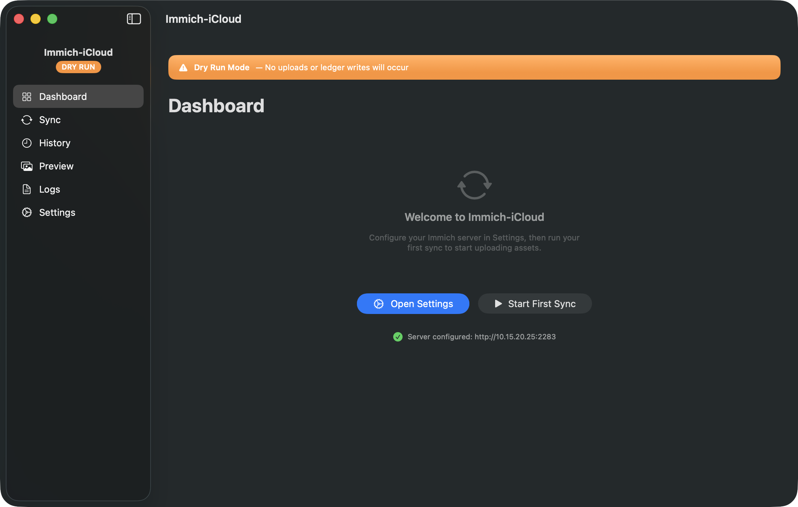
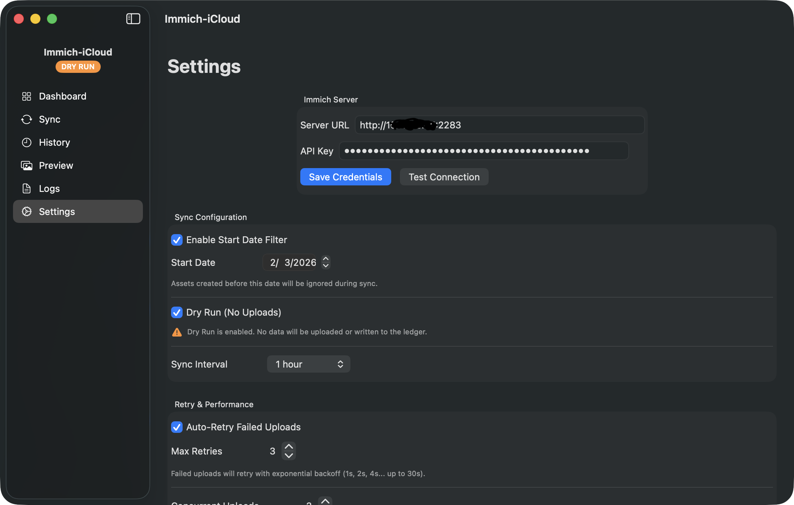
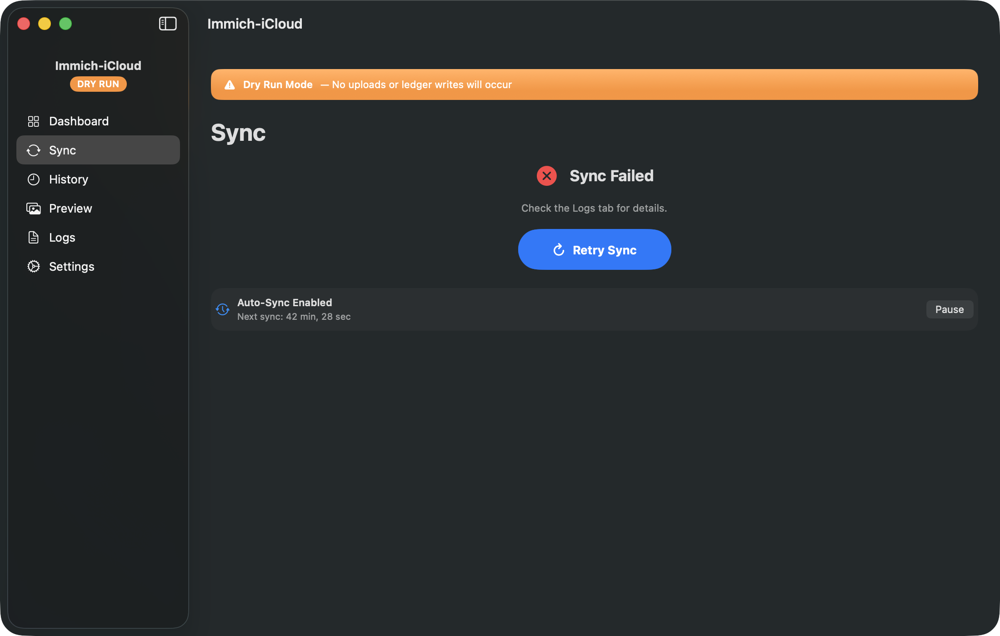
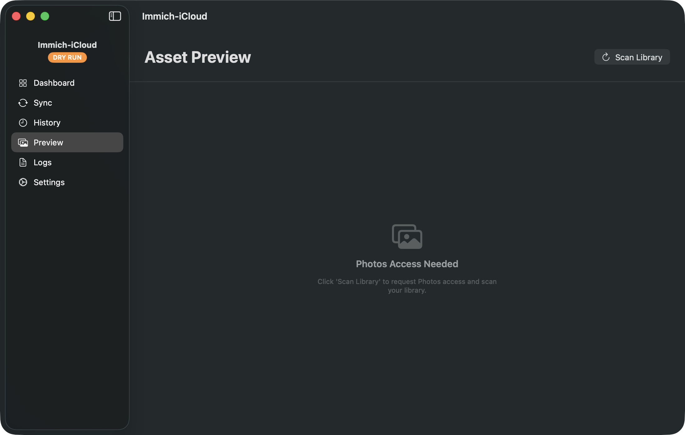
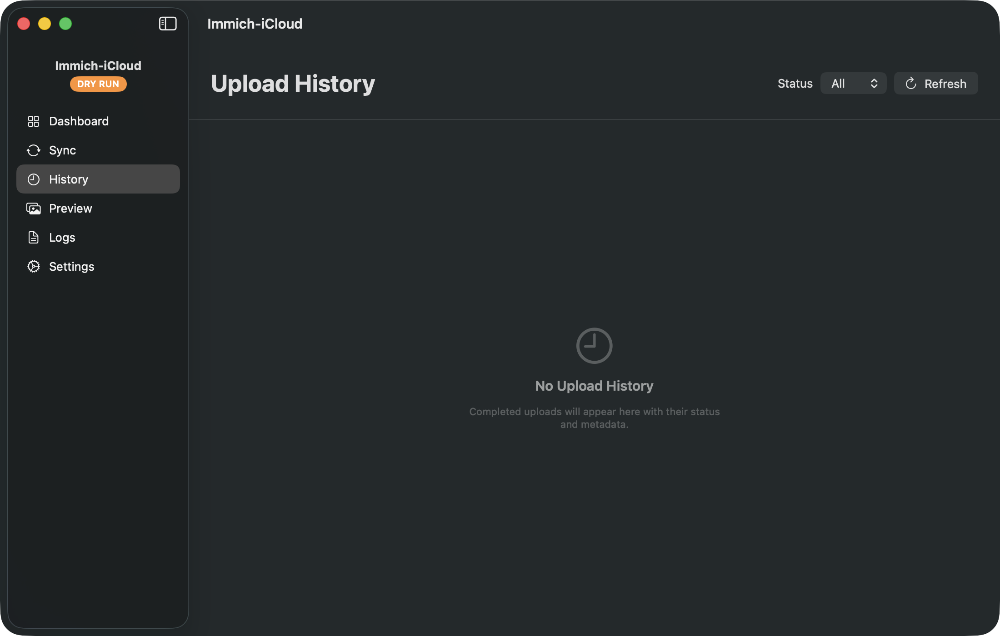

<p align="center">
  
</p>

<h1 align="center">Immich-iCloud</h1>

<p align="center">
  <strong>Sync your iCloud Photos library to a self-hosted Immich server.</strong><br>
  Every asset uploaded exactly once. Ledger-backed. No duplicates. Ever.
</p>

<p align="center">
  
  
  
  
</p>

---

## Why Immich-iCloud?

If you self-host [Immich](https://immich.app) but your primary photo library lives in iCloud Photos, you need a bridge. Immich-iCloud is that bridge — a native macOS app that reads your Photos library via PhotoKit and uploads every photo and video to your Immich server, with a **strict one-time upload guarantee**.

A local SQLite ledger tracks every upload by both asset ID and content fingerprint (SHA-256). Once an asset is recorded as uploaded, it will **never** be uploaded again — even if you delete it from Immich, reinstall the app, or move to a new Mac (with a ledger backup).

---

## Screenshots

<table>
  <tr>
    <td align="center"><br><strong>Dashboard</strong></td>
    <td align="center"><br><strong>Settings</strong></td>
  </tr>
  <tr>
    <td align="center"><br><strong>Sync</strong></td>
    <td align="center"><br><strong>Logs</strong></td>
  </tr>
  <tr>
    <td align="center"><br><strong>Asset Preview</strong></td>
    <td align="center"><br><strong>Upload History</strong></td>
  </tr>
</table>

---

## Features

### Core Sync Engine
- **One-time upload guarantee** — every asset is uploaded exactly once, tracked by local ID and SHA-256 content fingerprint
- **Dry Run mode** — simulate a full sync without uploading data or writing to the ledger (enabled by default)
- **Start Date filter** — only sync assets created after a specific date
- **Checkpoint & resume** — interrupted syncs save progress; resume from where you left off
- **Concurrent uploads** — upload 1-5 assets simultaneously via Swift TaskGroup

### Smart Filtering
- **Media type filter** — sync photos only, videos only, or both
- **Favorites only** — restrict sync to assets marked as favorites
- **Album-based filtering** — include or exclude specific albums from sync

### Automatic Sync
- **Scheduled sync** — auto-sync at configurable intervals (15 min to 24 hours)
- **Wake sync** — automatically syncs after your Mac wakes from sleep
- **Launch sync** — syncs on app launch with a brief delay for network reconnection
- **Pause/Resume** — temporarily pause the scheduler without disabling auto-sync

### Retry & Resilience
- **Exponential backoff** — failed uploads retry with increasing delays (1s, 2s, 4s... up to 30s)
- **Configurable retries** — set max retry attempts (1-10) per asset
- **Smart retry logic** — only retries on transient errors (network, 5xx); skips on client errors (4xx)

### Native macOS Experience
- **SwiftUI interface** — modern, native look with dark mode support
- **Menu bar icon** — quick-glance sync status with idle, syncing, and error states
- **Dock badge** — upload count shown on the dock icon during sync
- **macOS notifications** — alerts on sync complete or failure
- **Keyboard shortcuts** — Cmd+1-6 for navigation, Cmd+Shift+S to sync, Cmd+? for help
- **Built-in Help Guide** — comprehensive 14-section guide with troubleshooting

### Security
- **Keychain storage** — API keys are stored in the macOS Keychain, never on disk
- **No sandbox escape** — runs outside sandbox for direct PhotoKit and Keychain access
- **HTTPS only** — communicates with Immich via `x-api-key` header over HTTPS
- **Zero telemetry** — no data is sent anywhere except your Immich server

### Data Safety
- **Ledger is authoritative** — the local database, not Immich, determines upload status
- **Fingerprint deduplication** — duplicate files (same content, different IDs) are caught by SHA-256
- **Failure cannot overwrite success** — a failed record never downgrades an "uploaded" record
- **Export/Import backup** — migrate your ledger and settings to a new Mac
- **Auto-update** — Sparkle-based update checks from GitHub Releases

---

## Installation

### Download

1. Go to [**Releases**](https://github.com/bytePatrol/Immich-iCloud/releases)
2. Download the latest `Immich-iCloud-x.x.x.dmg`
3. Open the DMG and drag **Immich-iCloud** to your Applications folder
4. Launch from Applications

### Requirements

- macOS 14.0 (Sonoma) or later
- A running [Immich](https://immich.app) server (v1.90+)
- An Immich API key (generate one in Immich > Account Settings > API Keys)

---

## Quick Start

1. **Configure your server** — Open Settings (Cmd+6), enter your Immich server URL and API key, click **Save Credentials**, then **Test Connection**
2. **Grant Photos access** — When prompted, allow Immich-iCloud to access your Photos library
3. **Dry Run first** — Dry Run is enabled by default. Go to Sync (Cmd+2) and click **Start Sync** to preview what would be uploaded
4. **Review logs** — Check the Logs tab (Cmd+5) to see what was scanned and what would be uploaded
5. **Sync for real** — Disable Dry Run in Settings, then run another sync to start uploading

> **Tip:** The onboarding wizard walks you through these steps automatically on first launch.

---

## Ledger Guarantees

The ledger is the heart of Immich-iCloud's safety model. These guarantees are enforced in code and covered by tests:

| Guarantee | Description |
|---|---|
| **Upload once** | Once `recordUpload` writes a record with status `uploaded`, that asset is permanently marked and cannot be overwritten |
| **Fingerprint dedup** | Each asset is SHA-256 hashed. If two local assets share identical content, only the first is uploaded |
| **Authoritative ledger** | The ledger — not Immich — decides whether an asset has been uploaded. Deleting from Immich does not trigger re-upload |
| **Failure safe** | A `recordFailure` call is silently ignored if the asset already has `uploaded` status |
| **Lookup failure = skip** | If a ledger lookup throws, the asset is **skipped** rather than risking a duplicate upload |

---

## Keyboard Shortcuts

| Shortcut | Action |
|---|---|
| `Cmd+1` - `Cmd+6` | Navigate between tabs |
| `Cmd+Shift+S` | Start Sync |
| `Cmd+.` | Cancel Sync |
| `Cmd+R` | Refresh |
| `Cmd+?` | Help Guide |

---

## Migration & Backup

### Moving to a New Mac

1. On the old Mac: Settings > Data Management > **Export Ledger + Settings**
2. Transfer the `.immich-icloud-backup` file to the new Mac
3. On the new Mac: Settings > Data Management > **Import Ledger + Settings**
4. Re-enter your API key (keys stay in the Keychain, never exported)

The imported ledger carries all upload history — previously synced assets will not be re-uploaded.

---

## Building from Source

### Prerequisites

- Xcode 16.0+
- [XcodeGen](https://github.com/yonaskolb/XcodeGen) — `brew install xcodegen`
- [create-dmg](https://github.com/create-dmg/create-dmg) — `brew install create-dmg` (for packaging)

### Build

```bash
# Generate the Xcode project from project.yml
xcodegen generate

# Build (Debug)
xcodebuild -project Immich-iCloud.xcodeproj -scheme Immich-iCloud -configuration Debug build

# Run tests (52 tests)
xcodebuild -project Immich-iCloud.xcodeproj -scheme Immich-iCloud -configuration Debug test
```

### Package a DMG

```bash
# Build Release + create styled DMG
./Scripts/build_dmg.sh

# Skip tests if you've already run them
./Scripts/build_dmg.sh --skip-tests
```

### Version Management

```bash
# Bump version (auto-increments build number)
./Scripts/bump_version.sh 1.2.0

# Bump with explicit build number
./Scripts/bump_version.sh 1.2.0 5
```

---

## Architecture

| Layer | Technology |
|---|---|
| **UI** | SwiftUI + NavigationSplitView, `@Observable` pattern (macOS 14+) |
| **State** | `AppState` as single source of truth, passed via `.environment()` |
| **Database** | [GRDB](https://github.com/groue/GRDB.swift) + SQLite in WAL mode |
| **Photos** | PhotoKit (PHAsset, PHAssetResource, PHCachingImageManager) |
| **Networking** | URLSession with multipart form uploads |
| **Secrets** | macOS Keychain via Security framework |
| **Concurrency** | Swift async/await with actor isolation + TaskGroup |
| **Auto-Update** | [Sparkle](https://sparkle-project.org) 2.x with EdDSA signatures |
| **Notifications** | UserNotifications framework |
| **Build** | XcodeGen + SPM for dependency management |

---

## Project Structure

```
Immich-iCloud/
├── App/                    # App entry point, delegate, menu bar, commands
├── Core/                   # AppConfig, AppVersion, FilterConfig, Models
├── Database/               # GRDB ledger (LedgerStore, records, migrations)
├── Services/               # ImmichClient, PhotoKit, Keychain, Fingerprint
├── Sync/                   # SyncEngine, RetryPolicy, SyncScheduler, Checkpoint
├── UI/                     # SwiftUI views (Dashboard, Sync, History, Preview, Logs, Settings)
│   ├── Components/         # Reusable components (StatCard, StatusPill, DryRunBanner)
│   └── Onboarding/         # 5-step setup wizard
├── Utilities/              # Logger, error types
├── Info.plist
└── Immich-iCloud.entitlements
Immich-iCloudTests/         # 52 tests (ledger safety, dry run, migration, retry, filters, scheduler)
Scripts/                    # build_dmg, sign_and_notarize, bump_version, appcast template
```

---

## License

All rights reserved. See [LICENSE](LICENSE) for details.

---

<p align="center">
  Made with care for the <a href="https://immich.app">Immich</a> community.
</p>
